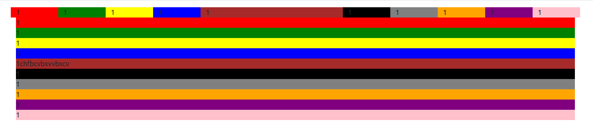
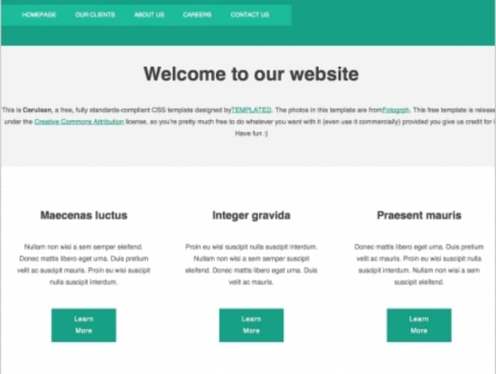

# 
 LocalHost   Bootstrap Grid layout tutorial📚

## 📝 Full Description

 The assignment involved replicating the design below using HTML, CSS, and Bootstrap. This project helped reinforce understanding of Bootstrap’s grid layout and various CSS classes and i gained valuable skills in responsive web design, HTML structuring, and visual presentation.   

  
## ⚙ Built Using
* [HTML5](https://www.w3schools.com/html/)
* [CSS](https://www.w3schools.com/css/default.asp)
* [Bootstrap 5](https://getbootstrap.com/)
* [VS Code](https://code.visualstudio.com/Download)

  
## 🗂 UX Design
### Bootstrap Grid

### Task

## 👨‍💻 Author
<b><i>Taku Collins Ayamba</b></i>

